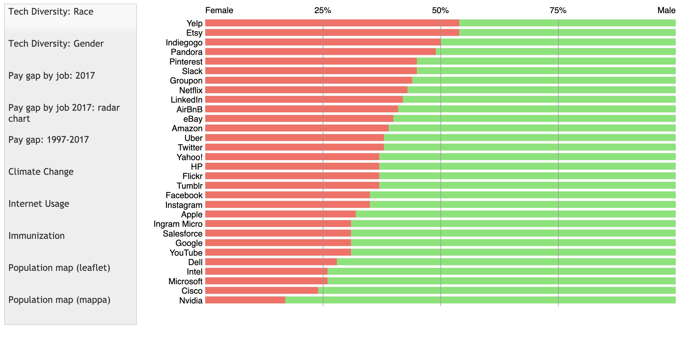

# Implemented features: 
This was created on top of some already provided code, the challenge was to work in a pair and create more advanced visualisations (some from scratch some improved upon older ones). The below is what we came up with. If you go to https://simasces.github.io/VisualisationYear1/ you can see the visualisation. By Simas Cesnauskas(https://github.com/SimasCes) and Daniel Cosby(https://github.com/daaanosaur).

# Tech Diversity: Race 

The pie chart helper function was changed to make a donut-chart by drawing another ellipse on-top of the pie-chart. The arc method was used at first, but this had errors (such as the colour below would clip through), so an ellipse was used instead. Text is displayed in the centre, initially directions to move the mouse over the donut-chart, and depending on the colour it is on, the percentage of the segment will be displayed in the middle. Using RGB colour values, the programme checks if the colour the mouse is on is the same as the colours in an array, then if it is true for a value (checks with an array), it then displays the percentage for the corresponding data to 2d.p. There is also an if statement, to make sure you cannot trigger this colour check outside of the donut chart parameters.

# Tech Diversity: Gender

Added 2 more % lines (a 25% and 75%) so it is easier to compare the differences between the genders.

# Pay gap by job: 2017

Added a background grid, axis labels, and hover-over titles for the bubbles, based on the sector they represent. The hover-over titles switch from left-aligned to right-aligned depending on the side of the screen to ensure they always display correctly. The bubbles have been coloured in shades of green to red based on how far they are from the centre of the graph, i.e. how far they are from an equal position. Modal pop-ups have been added, which involved adding some HTML and CSS in addition to the JavaScript, although this could have been inserted and removed using jQuery.

# Pay gap by job: radar chart

The radar chart was constructed from scratch, drawing concentric circles with 6 axes radiating from the centre. These axes are then labelled, and the data is plotted to them using vectors. The points are illustrated by coloured dots and joined by lines to create a visually coherent representation of the data. The desired row of data is selected by the user in a DOM selector and using the findRow function.

# Pay gap: 1997 – 2017

Added sliders, making an ability to ‘zoom’ in/out on sections of the graph; and the zoom is smooth. The years also change on the bottom as you zoom in/out, and the grid(grey) changes size. 

# Climate change

Added a selection at the top. You are able to choose 2 of the RGB colours for the graph that is being displayed (there will always be a pink undertone with the colour selection). There are 3 options for each selector (6 in total). 

# Internet Usage

Found new data and converted it into a csv file, then created a new visualisation to display the gender and age of people who use the internet in 2012 and 2017. Each set of circles is colour coded and the size of the circle is the percentage of users in that group. The circles are created by a constructor (which again was created from scratch). The constructor itself is a template for the circles and also has a check function (making sure the circles do not go off the screen). Furthermore, if you click space, the circles will stop/start moving to make it easier to view them. There is also a key at the top to see which group each circle belongs to.

# Immunization

Found new data and converted it into a csv file, then created a new visualisation. Created a dot plot chart of the immunisation rates in different boroughs. There is a red and a blue dot, each represents a different bacteria/virus (there is a key to see which colour represents what pathogen). Moreover, if you hover your mouse over one of the dots, the percentage will appear in the middle of the screen (quite large font) and it will be to 1d.p. The colour is made to be transparent, meaning if the 2 values overlap of the different pathogens, the percentage will appear in purple (instead of just red or blue).

# Map of city population

We initially created a map using mappa.js library (which also has the leaflet.js library inside the code). There are data points on the map. When the mouse goes over a data point, the data point changes colour (to dark purple) and then displays the name of the city and the population. The dots are transparent, so they can be seen if they overlap. If the mouse goes over more than one point, they are displayed on top of each other and the colour gets lighter the more points that there are (going to pink). There are also a few if statements making sure that the text is never displayed off screen. 

We were unable to load the tilemap properly in Mappa, and made a version using leaflet. Both are included as the leaflet version has much less of our own code in it and relies heavily on leaflet library functions.

